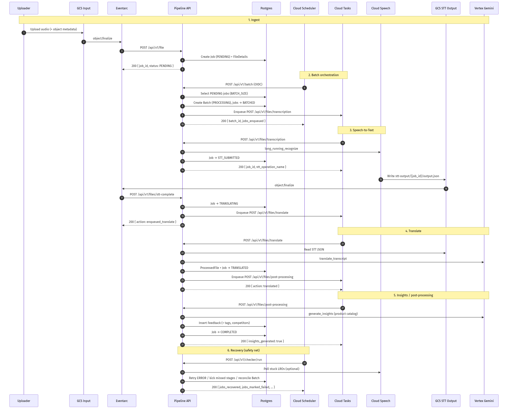
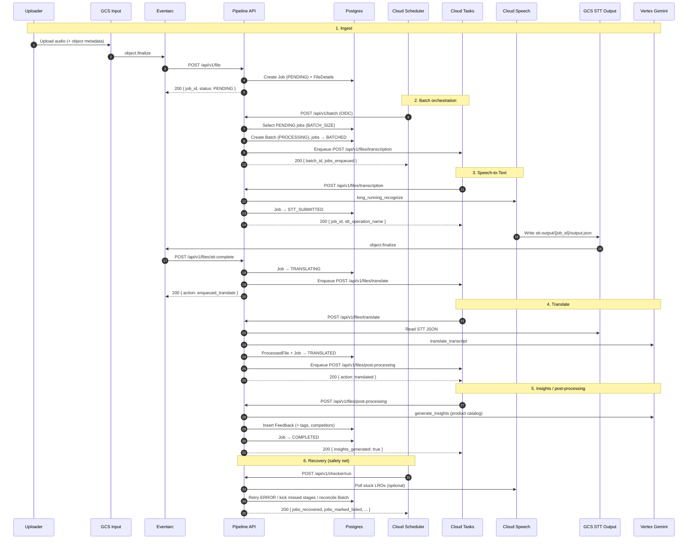

# Batch process sequence

End-to-end flow for the Pidilite user-feedback pipeline: GCS audio ingest through batch orchestration, Speech-to-Text, translation, and Gemini insights.

HTTP contracts for each step: [api-endpoints.md](api-endpoints.md).

## Participants

| Actor | Role |
|-------|------|
| Uploader | Client / field app uploading audio to GCS |
| GCS Input | Raw audio bucket (`GCS_INPUT_BUCKET`) |
| Eventarc | GCS `object.finalize` → HTTP to Cloud Run |
| Pipeline API | This service (`:8001`) |
| Postgres | Jobs, batches, transcripts, feedback |
| Cloud Scheduler | Periodic `/batch` and `/checker/run` |
| Cloud Tasks | Per-job HTTP callbacks (STT, translate, post-process) |
| Cloud Speech | Long-running recognize (LRO) |
| GCS STT Output | Transcript JSON bucket (`GCS_OUTPUT_BUCKET`) |
| Vertex Gemini | Translate + insights generation |

## Sequence diagram



<details>
<summary>Mermaid source</summary>



</details>

## Job status progression

```
PENDING
  → BATCHED
  → STT_SUBMITTED
  → STT_COMPLETED
  → TRANSLATING
  → TRANSLATED
  → PROCESSING / NORMALIZED / INSIGHTS
  → COMPLETED

ERROR  → (checker retries up to MAX_RETRY_COUNT) → FAILED
```

## Batch statuses

After checker reconciliation, a `Batch` ends as:

- `COMPLETED` — all jobs succeeded
- `PARTIAL_SUCCESS` — mix of success and failure
- `FAILED` — no successful jobs

## Triggers summary

| Step | Trigger | Endpoint |
|------|---------|----------|
| Ingest | Eventarc on input bucket | `POST /api/v1/file` |
| Batch | Cloud Scheduler | `POST /api/v1/batch` |
| STT submit | Cloud Tasks | `POST /api/v1/files/transcription` |
| STT done | Eventarc on output bucket | `POST /api/v1/files/stt-complete` |
| Translate | Cloud Tasks | `POST /api/v1/files/translate` |
| Insights | Cloud Tasks | `POST /api/v1/files/post-processing` |
| Checker | Cloud Scheduler / ops | `POST /api/v1/checker/run` |
