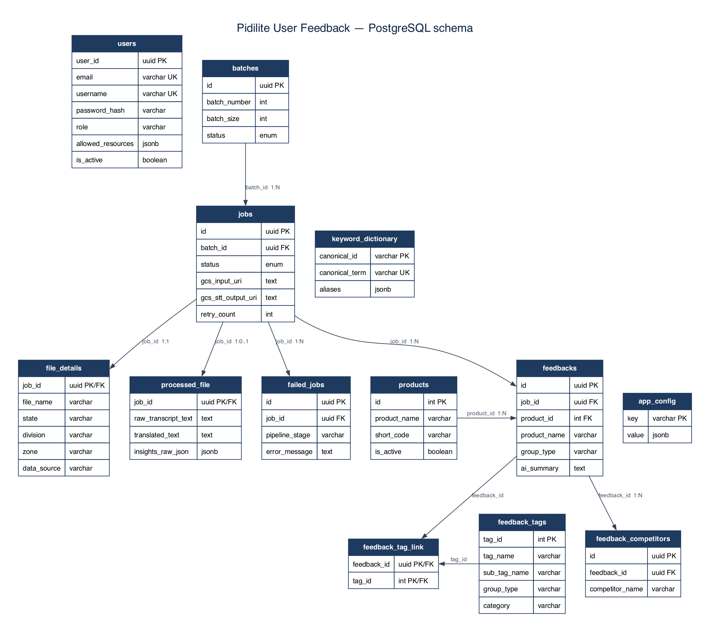

# Database schema

Source of truth: [`db/models.py`](../db/models.py)  
Enums: [`core/enums.py`](../core/enums.py)  
Migrations: [`alembic/versions/`](../alembic/versions/)

PostgreSQL schema used by the Pidilite pipeline service (jobs, transcripts, feedback, lookups). Shared with the broader Pidilite stack where applicable.

---

## ER overview

Source: [`db/models.py`](../db/models.py) (current ORM).



Vector copy: [assets/db-schema-er.svg](assets/db-schema-er.svg). Graphviz source: [assets/db-schema.dot](assets/db-schema.dot). Compact Mermaid: [assets/db-schema.mmd](assets/db-schema.mmd).

Regenerate the PNG/SVG:

```bash
dot -Tpng -Gdpi=160 -o docs/assets/db-schema-er.png docs/assets/db-schema.dot
dot -Tsvg -o docs/assets/db-schema-er.svg docs/assets/db-schema.dot
```

<details>
<summary>Full-column Mermaid source</summary>

```mermaid
erDiagram
    users {
        uuid user_id PK
        varchar email UK
        varchar username UK
        varchar password_hash
        varchar full_name
        varchar role
        jsonb allowed_resources
        boolean is_active
        timestamptz created_at
        timestamptz updated_at
    }

    batches {
        uuid id PK
        int batch_number
        int batch_size
        enum status
        timestamptz created_at
        timestamptz completed_at
    }

    jobs {
        uuid id PK
        text gcs_input_uri
        text gcs_stt_output_uri
        uuid batch_id FK
        enum status
        text error_message
        int retry_count
        varchar stt_operation_name
        timestamptz created_at
        timestamptz updated_at
    }

    file_details {
        uuid job_id PK_FK
        varchar file_name
        timestamptz file_uploaded_at
        varchar mime_type
        bigint file_size_bytes
        varchar file_extension
        varchar checksum_sha256
        timestamptz call_date
        int audio_duration_seconds
        varchar language_code
        varchar state
        varchar division
        varchar zone
        varchar cluster
        varchar rfmm_cluster
        varchar town_city
        varchar tsi_territory_code
        varchar fme_code
        varchar tty_code
        varchar user_id_metadata
        varchar user_type
        varchar data_source
    }

    processed_file {
        uuid job_id PK_FK
        text gcs_transcript_uri
        text raw_transcript_text
        text translated_text
        jsonb insights_raw_json
        text empty_reason
        timestamptz processed_at
    }

    failed_jobs {
        uuid id PK
        uuid job_id FK
        varchar file_name
        text error_message
        varchar pipeline_stage
        timestamptz created_at
    }

    products {
        int id PK
        varchar product_name
        varchar short_code
        text description
        boolean is_active
    }

    feedbacks {
        uuid id PK
        uuid job_id FK
        varchar product_name
        int product_id FK
        varchar group_type
        varchar category_type
        text verbatim_quote
        text ai_summary
        timestamptz created_at
    }

    feedback_tags {
        int tag_id PK
        varchar tag_name
        varchar sub_tag_name
        text description
        varchar group_type
        varchar category
        boolean is_active
    }

    feedback_tag_link {
        uuid feedback_id PK_FK
        int tag_id PK_FK
    }

    feedback_competitors {
        uuid id PK
        uuid feedback_id FK
        varchar competitor_name
        timestamptz created_at
    }

    keyword_dictionary {
        varchar canonical_id PK
        varchar canonical_term UK
        varchar category
        jsonb language
        jsonb aliases
        int priority
        timestamptz effective_from
        varchar owner
        int version
        timestamptz updated_at
    }

    app_config {
        varchar key PK
        jsonb value
        varchar description
        timestamptz updated_at
    }

    batches ||--o{ jobs : "batch_id"
    jobs ||--|| file_details : "job_id"
    jobs ||--o| processed_file : "job_id"
    jobs ||--o{ feedbacks : "job_id"
    jobs ||--o{ failed_jobs : "job_id"
    products ||--o{ feedbacks : "product_id"
    feedbacks ||--o{ feedback_tag_link : ""
    feedback_tags ||--o{ feedback_tag_link : ""
    feedbacks ||--o{ feedback_competitors : "feedback_id"
```

</details>

**Pipeline core:** `batches` → `jobs` → (`file_details` 1:1, `processed_file` 1:1, `failed_jobs` 1:N) → `feedbacks` → tags / competitors.

**Standalone:** `users`, `keyword_dictionary`, `app_config`.

---

## Enums

### `JobStatus` (`jobs.status`)

| Value | Meaning |
|-------|---------|
| `PENDING` | Registered, awaiting batch |
| `BATCHED` | In a batch, awaiting STT |
| `STT_SUBMITTED` | Cloud Speech LRO started |
| `STT_COMPLETED` | STT JSON written to GCS |
| `TRANSLATING` | Translate task in progress |
| `TRANSLATED` | Translation done; post-process enqueued |
| `PROCESSING` | Post-processing / normalize started |
| `NORMALIZED` | Product names corrected; insights pending |
| `INSIGHTS` | Gemini insights in progress |
| `COMPLETED` | Pipeline finished |
| `ERROR` | Transient error; eligible for retry |
| `FAILED` | Exceeded `MAX_RETRY_COUNT` |

### `BatchStatus` (`batches.status`)

| Value | Meaning |
|-------|---------|
| `PENDING` | Created, not started |
| `PROCESSING` | Jobs being processed |
| `COMPLETED` | All jobs succeeded |
| `PARTIAL_SUCCESS` | Mix of success and failure |
| `FAILED` | No successful jobs |

---

## Tables

### `users`

Auth / access identities (shared with dashboard stack).

| Column | Type | Notes |
|--------|------|--------|
| `user_id` | UUID PK | Default UUID |
| `email` | VARCHAR(255) UK | Indexed |
| `username` | VARCHAR(100) UK | Nullable, indexed |
| `password_hash` | VARCHAR(255) | Nullable |
| `full_name` | VARCHAR(200) | Nullable |
| `role` | VARCHAR(50) | Default `user` |
| `allowed_resources` | JSONB | Default `[]` |
| `is_active` | BOOLEAN | Default `true` |
| `created_at` | TIMESTAMPTZ | Server default `now()` |
| `updated_at` | TIMESTAMPTZ | Auto-updated |

---

### `batches`

Groups of jobs flushed by `POST /api/v1/batch`.

| Column | Type | Notes |
|--------|------|--------|
| `id` | UUID PK | Default UUID |
| `batch_number` | INTEGER | Auto-increment |
| `batch_size` | INTEGER | Default `10` |
| `status` | ENUM(`BatchStatus`) | Indexed; default `PENDING` |
| `created_at` | TIMESTAMPTZ | Server default `now()` |
| `completed_at` | TIMESTAMPTZ | Nullable |

**Relationships:** `jobs` (1 → many)

---

### `jobs`

One row per audio file / pipeline run.

| Column | Type | Notes |
|--------|------|--------|
| `id` | UUID PK | Default UUID |
| `gcs_input_uri` | TEXT | Required input audio URI |
| `gcs_stt_output_uri` | TEXT | Nullable STT output URI |
| `batch_id` | UUID FK → `batches.id` | `ON DELETE SET NULL`, indexed |
| `status` | ENUM(`JobStatus`) | Indexed; default `PENDING` |
| `error_message` | TEXT | Nullable |
| `retry_count` | INTEGER | Default `0` |
| `stt_operation_name` | VARCHAR(500) | Cloud Speech LRO name |
| `created_at` | TIMESTAMPTZ | Indexed |
| `updated_at` | TIMESTAMPTZ | Auto-updated |

**Relationships:** `batch`, `file_details` (1:1), `processed_file` (1:1), `feedbacks` (1 → many), `failed_jobs` (1 → many)

---

### `failed_jobs`

Pipeline failure audit rows.

| Column | Type | Notes |
|--------|------|--------|
| `id` | UUID PK | Default UUID |
| `job_id` | UUID FK → `jobs.id` | `ON DELETE CASCADE` |
| `file_name` | VARCHAR(255) | Nullable |
| `error_message` | TEXT | Required |
| `pipeline_stage` | VARCHAR(50) | e.g. `INGEST`, `STT`, `TRANSLATE`, `INSIGHTS` |
| `created_at` | TIMESTAMPTZ | Server default `now()` |

---

### `file_details`

Ingest metadata for a job (PK = `job_id`).

| Column | Type | Notes |
|--------|------|--------|
| `job_id` | UUID PK/FK → `jobs.id` | `ON DELETE CASCADE` |
| `file_name` | VARCHAR(500) | Required |
| `file_uploaded_at` | TIMESTAMPTZ | Server default `now()` |
| `mime_type` | VARCHAR(100) | Nullable |
| `file_size_bytes` | BIGINT | Nullable |
| `file_extension` | VARCHAR(20) | Nullable |
| `checksum_sha256` | VARCHAR(64) | Nullable |
| `call_date` | TIMESTAMPTZ | Conversation time; indexed |
| `audio_duration_seconds` | INTEGER | Nullable |
| `language_code` | VARCHAR(20) | e.g. `hi-IN`; indexed |
| `state` | VARCHAR(100) | BI filter; indexed |
| `division` | VARCHAR(100) | Indexed |
| `zone` | VARCHAR(100) | Indexed |
| `cluster` | VARCHAR(100) | Indexed |
| `rfmm_cluster` | VARCHAR(100) | Indexed |
| `town_city` | VARCHAR(100) | Indexed |
| `tsi_territory_code` | VARCHAR(100) | Indexed |
| `fme_code` | VARCHAR(100) | Indexed |
| `tty_code` | VARCHAR(100) | Indexed |
| `user_id_metadata` | VARCHAR(100) | Indexed (uploader id from object metadata) |
| `user_type` | VARCHAR(100) | Indexed |
| `data_source` | VARCHAR(100) | Default `Voice Conversations`; indexed |

Dashboard filter fields are typically populated from GCS object metadata on ingest (`POST /api/v1/file`).

---

### `processed_file`

Transcripts and raw LLM insights payload (PK = `job_id`).

| Column | Type | Notes |
|--------|------|--------|
| `job_id` | UUID PK/FK → `jobs.id` | `ON DELETE CASCADE` |
| `gcs_transcript_uri` | TEXT | STT JSON URI |
| `raw_transcript_text` | TEXT | Pre-translation text |
| `translated_text` | TEXT | English (or target) text |
| `insights_raw_json` | JSONB | Audit of Gemini insights payload |
| `empty_reason` | TEXT | Skip / empty-transcript justification |
| `processed_at` | TIMESTAMPTZ | Nullable |

---

### `products`

Product catalog used to resolve LLM product names.

| Column | Type | Notes |
|--------|------|--------|
| `id` | INTEGER PK | Auto-increment |
| `product_name` | VARCHAR(200) | Required |
| `short_code` | VARCHAR(50) | Nullable |
| `description` | TEXT | Nullable |
| `is_active` | BOOLEAN | Default `true` |

---

### `feedback_tags`

Lookup tags for many-to-many tagging.

| Column | Type | Notes |
|--------|------|--------|
| `tag_id` | INTEGER PK | Taxonomy integer ID |
| `tag_name` | VARCHAR(200) | Required; not unique (duplicate names allowed) |
| `sub_tag_name` | VARCHAR(200) | Nullable |
| `description` | TEXT | Nullable |
| `group_type` | VARCHAR(100) | Nullable |
| `category` | VARCHAR(100) | Nullable |
| `is_active` | BOOLEAN | Default `true` |

---

### `feedback_tag_link`

Junction table: feedback ↔ tags.

| Column | Type | Notes |
|--------|------|--------|
| `feedback_id` | UUID PK/FK → `feedbacks.id` | `ON DELETE CASCADE` |
| `tag_id` | INTEGER PK/FK → `feedback_tags.tag_id` | `ON DELETE CASCADE` |

---

### `feedbacks`

Granular AI-extracted feedback rows (verbatims + tagging).

| Column | Type | Notes |
|--------|------|--------|
| `id` | UUID PK | Default UUID |
| `job_id` | UUID FK → `jobs.id` | `ON DELETE CASCADE`, indexed |
| `product_name` | VARCHAR(200) | LLM-extracted name; indexed |
| `product_id` | INTEGER FK → `products.id` | Resolved server-side; nullable |
| `group_type` | VARCHAR(100) | Required |
| `category_type` | VARCHAR(100) | Nullable |
| `verbatim_quote` | TEXT | Nullable |
| `ai_summary` | TEXT | Required |
| `created_at` | TIMESTAMPTZ | Server default `now()` |

**Relationships:** `job`, `product`, `competitors` (cascade delete-orphan), `tags` (M2M via `feedback_tag_link`)

---

### `feedback_competitors`

Competitors mentioned on a feedback row.

| Column | Type | Notes |
|--------|------|--------|
| `id` | UUID PK | Default UUID |
| `feedback_id` | UUID FK → `feedbacks.id` | `ON DELETE CASCADE`, indexed |
| `competitor_name` | VARCHAR(200) | Required |
| `created_at` | TIMESTAMPTZ | Server default `now()` |

---

### `keyword_dictionary`

Normalization / keyword lookup for insights and product matching.

| Column | Type | Notes |
|--------|------|--------|
| `canonical_id` | VARCHAR(100) PK | |
| `canonical_term` | VARCHAR(300) UK | Required |
| `category` | VARCHAR(100) | Nullable |
| `language` | JSONB | Nullable |
| `aliases` | JSONB | Default `[]` |
| `priority` | INTEGER | Default `0` |
| `effective_from` | TIMESTAMPTZ | Server default `now()` |
| `owner` | VARCHAR(100) | Nullable |
| `version` | INTEGER | Default `1` |
| `updated_at` | TIMESTAMPTZ | Auto-updated |

---

### `app_config`

Runtime key/value configuration (e.g. effective batch size).

| Column | Type | Notes |
|--------|------|--------|
| `key` | VARCHAR(200) PK | |
| `value` | JSONB | Required |
| `description` | VARCHAR(500) | Nullable |
| `updated_at` | TIMESTAMPTZ | Auto-updated |

---

## Pipeline data flow (tables)

```
GCS audio finalize
  → jobs (PENDING) + file_details
  → batches + jobs (BATCHED)
  → jobs.stt_operation_name / gcs_stt_output_uri
  → processed_file (raw + translated text)
  → feedbacks + feedback_tag_link + feedback_competitors
  → jobs (COMPLETED) ; batches reconciled
```

---

## Migrations

Apply with Alembic:

```bash
# Docker Compose
docker compose exec api poetry run alembic upgrade head

# Host
poetry run alembic upgrade head
```

Model changes should be accompanied by a new revision under `alembic/versions/`.

---

## Power BI

Reporting views for the Cloud dump DB: [powerbi-views.md](powerbi-views.md).
