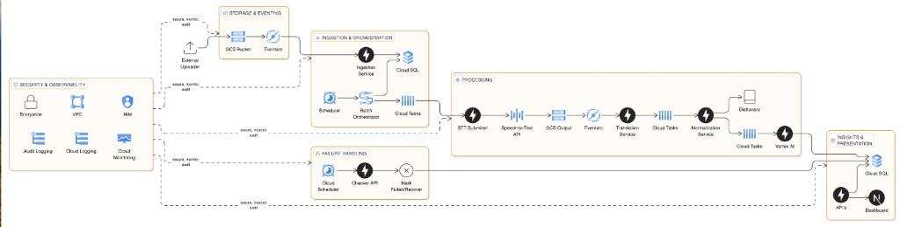

# User Feedback Pipeline — Overview and Power BI Access

---

## How the system works

Field and sales teams record conversations. Those recordings are uploaded to the cloud. The system turns each recording into English text, then into tagged feedback about products, users, and dealers. That feedback is what the dashboard and Power BI report on.

The application does not look for new files on its own. The cloud starts each step when a file arrives or when a scheduled run is due.

**Upload.** A recording is uploaded. The system registers it and waits to process it. The same file is not processed twice.

**Batch.** On a schedule, waiting files are grouped (about ten at a time) so speech and AI services are not overloaded.

**Process.** For each file the system converts speech to text, translates the text to English, and extracts comments (products, tags, competitors, and a short summary). When this finishes, the file is marked complete.

**Safety net.** A regular health check retries work that got stuck, marks true failures, and updates the group of files.

**Use the data.** Finished feedback is stored in the company database. The product dashboard and Power BI both read from that database. Reports should use the prepared reporting tables, not the raw working tables.

Security covers the whole process: who can access what, a private network, encryption, and logging. The database is not on the public internet.

---

## Requirements

1. Power BI must connect to the live company database so published reports can refresh on a schedule. A copy of the database on a laptop is not production access.
2. The database must stay off the public internet.
3. Infrastructure must provide a secure private path from Power BI to that database.
4. Security must provide a read-only reporting login, separate from the application login. That login must not be able to change pipeline data.
5. Passwords must not be stored in report files.
6. BI must publish the reports against that private path and run the refresh schedule.
7. Reporting must use the prepared reporting tables.
